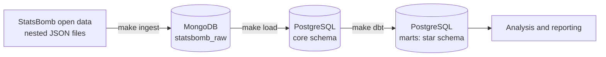

# football-analytics

Analytics platform for football match event data. Raw [StatsBomb open data](https://github.com/statsbomb/open-data) is stored as delivered in MongoDB, modelled into a relational warehouse in PostgreSQL, and served for analysis. The default dataset is the FIFA World Cup 2022: 64 matches and every on-ball event in them.

## Architecture



## Results

Measured on a laptop (Apple Silicon, Docker Desktop).

| What | Result |
|---|---|
| Raw load, FIFA World Cup 2022 | 1 competition, 64 matches, 128 team lineups, 234,637 events |
| Load time, first run (downloads 192 MB of JSON) | 21.0 s |
| Load time, rerun from local file cache | 15.0 s |
| Documents after loading twice | Unchanged (idempotent reload) |
| Relational load into PostgreSQL | 64 matches, 3,244 squad entries, 234,637 events, 1,494 shots, 68,515 passes; row counts reconciled with MongoDB |
| Relational load time, first run / rerun | 10.3 s / 7.5 s |

Query tuning ([details](docs/query-performance.md)), median of 25 runs:

| Query | Before | After |
|---|---|---|
| Team shots and xG by match | 16.68 ms | 0.28 ms |
| Player pass recipients | 10.16 ms | 1.06 ms |
| Full load into an empty schema (cost of the two indexes) | 8.9 s | 9.9 s |

Star schema built with dbt: `fact_events` (234,637 rows, one per event), `fact_shots` (1,494, one per shot), and dimensions for match (64), team (32), player (829), and date. 51 models and tests pass in 1.6 s, including a check that goals counted from events equal the official score of all 64 matches.

## Quick start

Requires Docker and [uv](https://docs.astral.sh/uv/).

```bash
cp .env.example .env   # set your own passwords
make up                # start PostgreSQL and MongoDB
uv sync                # install Python dependencies
make ingest            # load World Cup 2022 into MongoDB
make load              # build the PostgreSQL tables
make dbt               # build and test the star schema
make test
```

See [CONTRIBUTING.md](CONTRIBUTING.md) for the full workflow and all `make` targets.

## Design decisions

Architecture Decision Records live in [docs/adr/](docs/adr/):

- [ADR-001: Raw data in MongoDB, modelled data in PostgreSQL](docs/adr/001-raw-in-mongodb-modelled-in-postgresql.md)
- [ADR-002: dbt for the star schema](docs/adr/002-dbt-for-the-star-schema.md)

Datasets other components depend on are described in [docs/data-contracts/](docs/data-contracts/).

## Operations

Start, health checks, failure handling, and recovery: [docs/runbook.md](docs/runbook.md). Query tuning notes: [docs/query-performance.md](docs/query-performance.md).

## Data

Match data is provided by [StatsBomb](https://statsbomb.com/) through its open data repository, under the StatsBomb open data licence.
