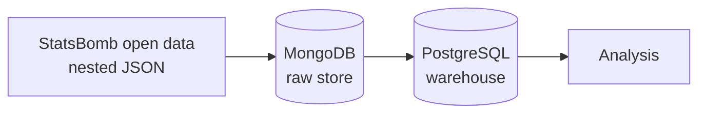

# football-analytics

Analytics platform for football match event data. Raw [StatsBomb open data](https://github.com/statsbomb/open-data) is stored as delivered in MongoDB, modelled into a relational warehouse in PostgreSQL, and served for analysis.

## Architecture



## Results

No measured results yet.

## Quick start

Requires Docker and [uv](https://docs.astral.sh/uv/).

```bash
cp .env.example .env   # set your own passwords
make up                # start PostgreSQL and MongoDB
uv sync                # install Python dependencies
make test              # confirm both databases answer
```

See [CONTRIBUTING.md](CONTRIBUTING.md) for the full workflow and all `make` targets.

## Design decisions

Architecture Decision Records live in [docs/adr/](docs/adr/).
